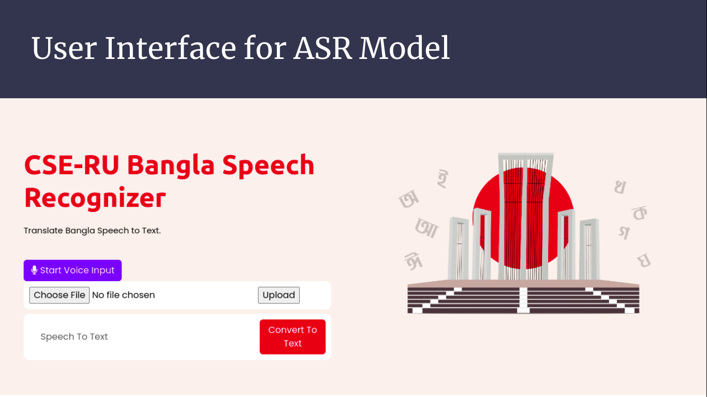
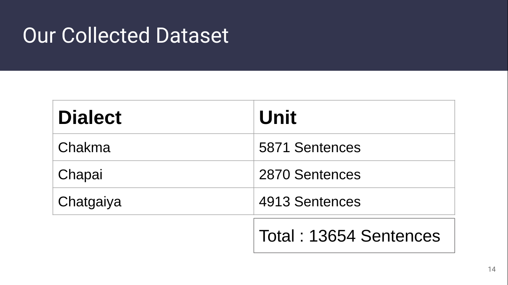
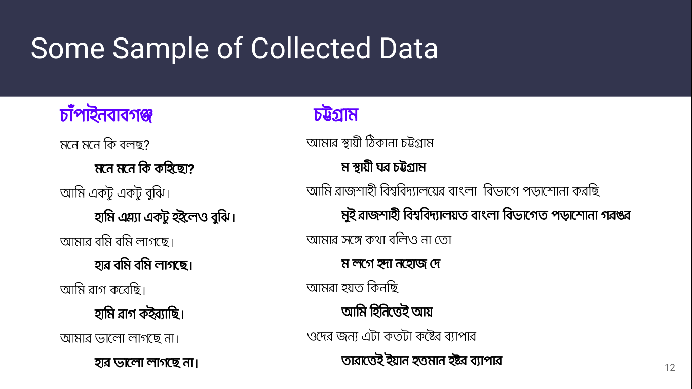
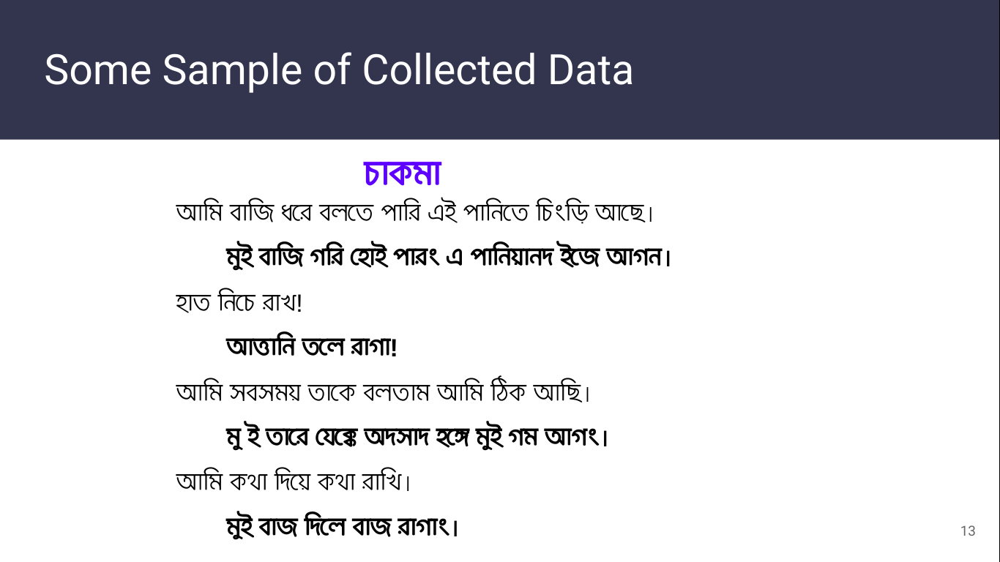
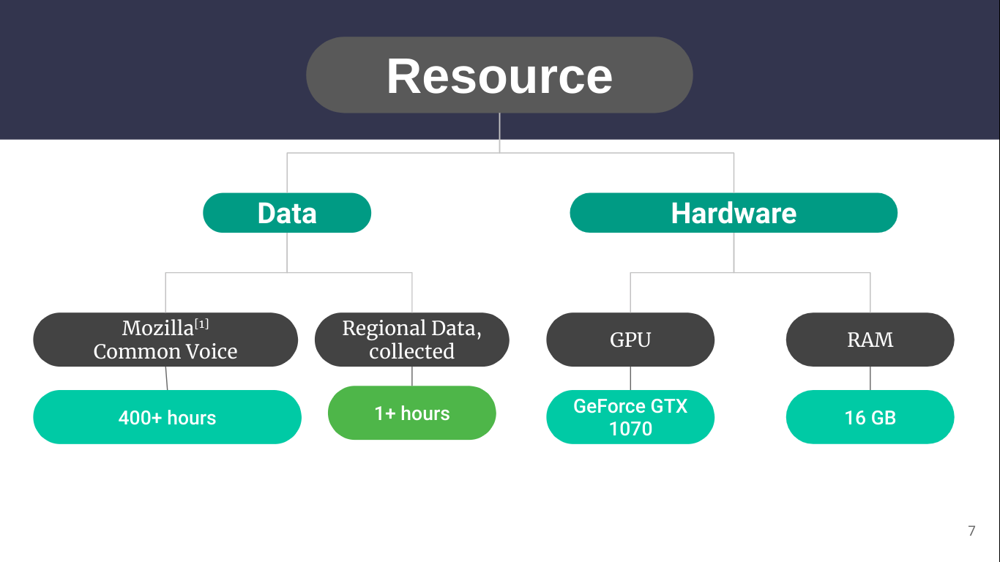

# Transformer-Based-End-To-End-Speech-Recognition-System-For-Bangla-Language

This repository contains our program and dataset used in our work on ASR for Bangali and regional dialects.

-----------------------------------------------------------------------------------------------------
# To run the system following module should be installed:
  1) Tensorflow
  2) Python
  3) Jupyter Notebook(optional)

# Dataset:

We have collected 13654 sentences from three different dialects (Chakma, Chapai, and Chatgaiya), and more data is being collected for local dialects. 
In addition, we are collecting speech of these dialects, which will be provided to the public as soon a sufficient annotation is available.

# Some of colected data sample

# Model:

This repository contains an ASR model that was trained during 95 epochs on a total of 30k datasets over the course of 55 hours, and with this model we obtained approximately 68% accuracy.

# Resource 
Resource uses for our dataset........

